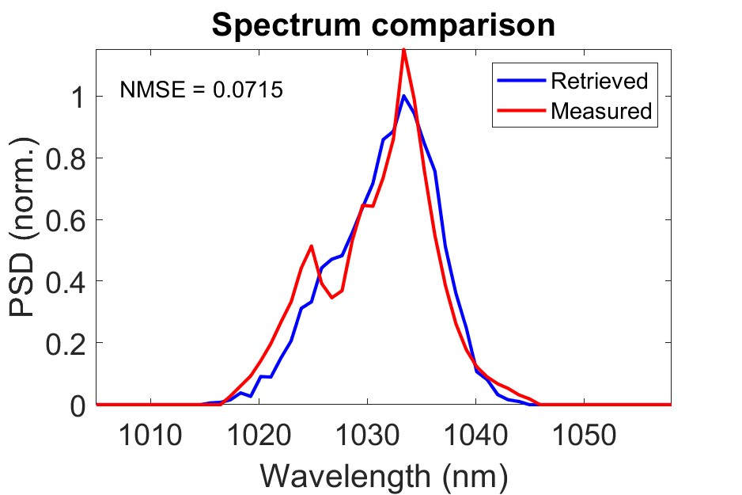

# FROG retrieval
This is the shared MATLAB GUI package to retrieve a frequency-resolved optical gating (FROG) trace and obtain the retrieved field. It currently reads the `raw` file exported by VideoFROG from [Mesaphotonics](https://mesaphotonics.com/), but, in principle, users can easily extend its capability by modifying `readRawFROG.m` function.

It is based on Pavel's "Ptychographic reconstruction algorithm" [[1]](#references-our-papers).

## Motivation
Most of the time, outputs from the commercial VideoFROG are good enough. However, due to VideoFROG's inherent constraint of limited sampling points in retrieval, it cannot retrieve a highly-chirped broadband pulse when it requires both huge time and frequency windows. Limited sampling points during retrieval mean that a larger frequency window is accompanied by a smaller time window. The measured FROG trace still contains all information. I was forced to write my own code to do the retrieval when I was attempting to measure the chirped pulse from a Mamyshev oscillator, which covers an ultrabroadband 1000-1150 nm with a long ~5-ps duration.

Additionally, VideoFROG's retrieved pulse doesn't center its pulse in frequency according to the measured FROG trace that should have all information, but to the user-defined `center wavelength` that a user can arbitrarily set (it has a box for this input). This makes no sense to me, so I made this code to correct this mistake. Furthermore, I added an extra capability such that it can load an independently-measured spectrum for extra calibration to check FROG's accuracy, in case there is misalignment or "omission to align at the correct time center" (this happens a lot to newbies).

## Capabilities:
1. Retrieve FROG trace with user-defined personalized controls, free from commercial softwares.
2. It's able to load the independently-measured spectrum for
   - having a very good initial guess for the retrieval algorithm.
   - comparison with the FROG-retrieved spectrum to verify the accuracy of the FROG retrieval.
   - Users can write their own loading function to load their spectrum beyond currently-supported Agilent, OceanOptics, and Thorlabs capabilities.
3. It's able to compute the delay and frequency marginals from the retrieved field and the FROG trace, as well as from the measured spectrum [[2]](#references-our-papers). This is also important to verify the accuracy of FROG retrieval. Delay marginal is also known as (temporal) autocorrelation. Frequency marginal is the spectral counterpart of autocorrelation but is applied to the spectrum (it's like the autocorrelation of the spectrum).
4. It computes all the important information of the retrieved pulse, such as Strehl ratio (dechirped over transform-limited peak powers), retrieved pulse duration, and transform-limited duration.
5. The number of sampling points required for retrieval is automatically determined from the user-defined time window for the retrieved pulse and the bandwidth information obtained from the FROG trace.
6. FROG trace is automatically re-sampled with different numbers of sampling points in frequency and delay (my initial motivation to make this code to measure a chirped pulse, mentioned above).
7. Export with MATLAB's `mat` file.

## References (papers):
1. [Ptychography](https://doi.org/10.1364/OPTICA.3.001320)
2. [FROG practical issues](https://ieeexplore.ieee.org/document/517026)
3. [Mamyshev oscillator](http://josab.osa.org/abstract.cfm?URI=josab-38-3-743)

## Demonstrations:
- **PLKM-compressed pulse**  
The pulse from a commercial laser, PHAROS, LightConversion, is nonlinearly compressed by a periodically-layered Kerr medium (PLKM).   
Source: "Examples/PLKM compressed pulse"  

  
https://github.com/user-attachments/assets/e554b2b8-9773-4536-96f5-c99f00d38e42

- **Mamyshev oscillator**  
The chirped pulse directly from a Mamyshev oscillator [[3]](#references-our-papers). This is beyond the capability of the commercial VideoFROG.  
Source: "Examples/linear Mamyshev oscillator"  
https://github.com/user-attachments/assets/112d2d25-28be-458b-96ed-bf5af5fee714

- **ANDi**  
This is the dechirped pulse of an all-normal-dispersion (ANDi) laser I measured in my early stage of PhD, so the pulse quality isn't very good with only 0.5 Strehl ratio. It's a good demonstration here though.  
Source: "Examples/ANDi"  
https://github.com/user-attachments/assets/9117af11-87e3-4fd7-a2d8-b5141aebeb92

## Notes:
I have written `Instruction.doc`. Please find details of how to use this package in it.